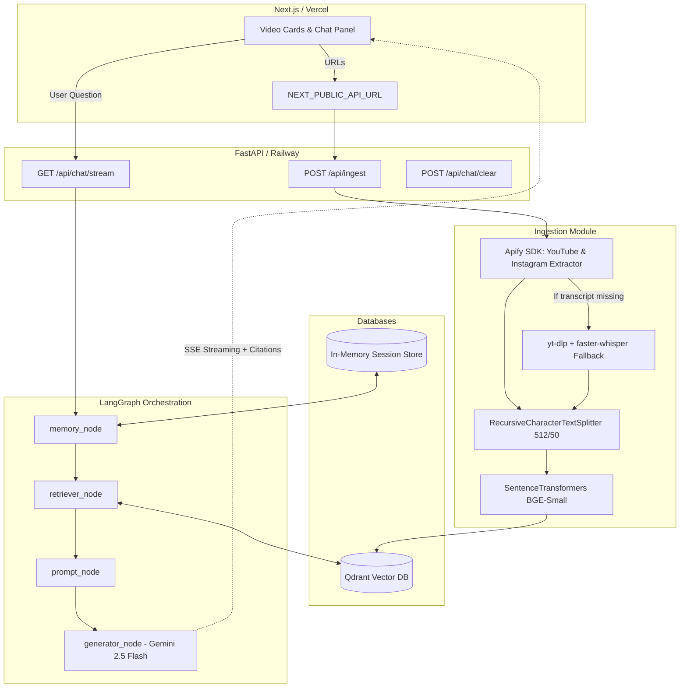
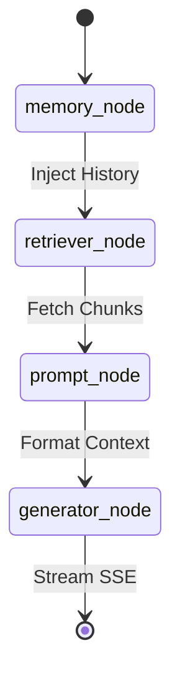

# CreatorJoy — RAG Chatbot Architecture

Full-Stack AI system for side-by-side creator video intelligence.
Built for resilience, performance, and dynamic multi-modal data extraction.

---

## Table of Contents
1. [System Overview](#1-system-overview)
2. [High-Level Architecture Diagram](#2-high-level-architecture-diagram)
3. [Component Breakdown](#3-component-breakdown)
   - Frontend
   - Backend API
   - Ingestion Pipeline & Whisper Fallback
   - Embedding & Vector Storage
   - LangGraph RAG Pipeline
   - Streaming Layer
4. [Data Flow — Step by Step](#4-data-flow--step-by-step)
5. [LangGraph State Machine](#5-langgraph-state-machine)
6. [Vector DB Schema](#6-vector-db-schema)
7. [Prompt Architecture](#7-prompt-architecture)
8. [Folder Structure](#8-folder-structure)
9. [Environment Variables](#9-environment-variables)

---

## 1. System Overview
CreatorJoy's RAG chatbot lets creators drop in two video URLs (YouTube + Instagram Reel) and have a streaming, memory-aware conversation that answers questions like:

- "Why did Video A get more engagement than Video B?"
- "Compare the hooks in the first 5 seconds."
- "Suggest improvements for B based on what worked in A."

Every response is streamed, cites its exact source (metadata or transcript), and remembers prior turns for seamless follow-up questions.

---

## 2. High-Level Architecture Diagram



---

## 3. Component Breakdown

### 3.1 Frontend (Next.js / React)
**Purpose:** Side-by-side video cards + real-time streaming chat panel.
Deployed on **Vercel**.

**Key Components:**
- **VideoCard:** Displays embedded video iframe, engagement rate, follower count, and metadata.
- **ChatPanel:** Sends messages, renders streamed tokens, and maps citations to individual responses.
- **IngestForm:** URL input form that triggers ingestion and handles the loading state.
- **API Utilities:** Uses `process.env.NEXT_PUBLIC_API_URL` to route requests to the Railway production backend, bypassing Next.js serverless function timeout limits.

### 3.2 Backend (FastAPI)
Deployed on **Railway**.

**Endpoints:**
- `POST /api/ingest`
  - Body: `{ video_a_url: str, video_b_url: str }`
  - Clears old data in Qdrant, runs the extraction pipeline, and embeds the new data.
- `POST /api/chat` (Standard) & `POST /api/chat/stream` (Streaming)
  - Body: `{ session_id: str, question: str }`
  - Triggers the LangGraph state machine. The streaming endpoint yields Server-Sent Events (SSE).
- `POST /api/chat/clear`
  - Clears the in-memory session history dict.

### 3.3 Ingestion Pipeline & Whisper Fallback
We utilize the **Apify Python SDK** to deeply scrape both YouTube and Instagram metadata (views, likes, comments, etc.).

**The Whisper Fallback System:**
Internet video is messy. If Apify returns a video but fails to locate a native transcript (very common on Instagram Reels or uncaptioned YouTube shorts), the system triggers `ingestion_service._apply_whisper_fallback(video_data)`.
This fallback:
1. Uses `yt-dlp` to download the audio track.
2. Uses `faster-whisper` to locally transcribe the audio.
3. Injects the generated transcript back into the pipeline as if it were native.

**Chunking:**
Uses LangChain's `RecursiveCharacterTextSplitter`:
- `chunk_size=512`
- `chunk_overlap=50`
This length captures conversational contexts perfectly without diluting retrieval precision.

### 3.4 Embedding & Vector Storage
**Embedder:** `BAAI/bge-small-en-v1.5` via `sentence-transformers`
- Free, local, no API key required.
- 384-dimensional vectors.

**Vector DB:** Qdrant (Local mode for development, managed Cloud for prod).
- Used because of its native payload filtering, which is critical for executing independent MMR searches on Video A vs Video B.

### 3.5 LangGraph RAG Pipeline
The backend uses LangGraph to manage the conversational state.

```python
class ChatState(TypedDict):
    session_id: str
    question: str
    history: list[dict]
    retrieved_chunks: list[dict]
    citations: list[dict]
    answer: str
```
- **Memory Node:** Injects `session_memory.get(session_id, [])` into the state.
- **Retriever Node:** Executes MMR (Maximal Marginal Relevance) searches against Qdrant.
- **Prompt Node:** Injects history, fetched chunks, and citations into the master prompt.
- **Generator Node:** Streams responses via Google's `gemini-2.5-flash` model. It contains defensive try/except blocks to catch `ValueError` if the model triggers a safety filter or generates an empty response, preventing 502 gateway crashes.

### 3.6 Streaming Layer
Uses `StreamingResponse (application/x-ndjson)` to yield JSON events:
- Token generation: `{"type": "token", "content": "The "}`
- Citation generation (post-stream): `{"type": "citations", "citations": [...]}`

---

## 4. Data Flow — Step by Step

1. **Ingestion:** User inputs YouTube/Instagram URLs.
2. **Extraction:** Backend invokes Apify scrapers.
3. **Fallback:** If transcripts are missing, `faster-whisper` generates them from `yt-dlp` audio.
4. **Embedding:** Text is chunked, embedded via BGE-Small, and upserted into Qdrant.
5. **Chat:** User asks "Why did A perform better?"
6. **State Initialization:** `/api/chat/stream` loads the specific `session_id` history.
7. **Retrieval:** LangGraph searches Qdrant for the closest semantic chunks.
8. **Generation:** `gemini-2.5-flash` is prompted with history + chunks and streams the response via SSE.
9. **Citation:** A secondary `filter_citations` LLM call evaluates exactly which retrieved chunks were actually utilized by the answer and passes them to the frontend.

---

## 5. LangGraph State Machine



---

## 6. Vector DB Schema
**Collection:** `creator_videos`
**Distance Metric:** Cosine
**Vector Size:** 384 (BGE-small)

**Payload:**
```json
{
  "video_id": "dQw4w9WgXcQ",
  "label": "Video A",
  "chunk_index": 3,
  "text": "The hook starts with a bold claim...",
  "source_url": "https://youtube.com/...",
  "creator": "@username",
  "platform": "youtube",
  "engagement_rate": 8.34,
  "views": 120000,
  "likes": 9800,
  "comments": 210,
  "duration": 213
}
```

---

## 7. Prompt Architecture
The system prompt strictly forces `gemini-2.5-flash` to restrict its world knowledge.

```text
You are a retrieval-augmented assistant.
Use ONLY the provided metadata, conversation history, and retrieved transcript context.
Do NOT use your own world knowledge.
Do NOT infer information that is not explicitly present in the supplied context.

If the answer cannot be determined from the provided context, respond exactly:
'I cannot determine this from the available video data.'

Previous Conversation:
{history_text}

Retrieved Context:
{context}

Current Question:
{question}
```

---

## 8. Folder Structure
```text
creatorjoy/
├── frontend/                  # Next.js app (Vercel)
│   ├── src/
│   │   ├── components/        # ChatPanel, VideoCard, Citations
│   │   ├── lib/               # api.ts (Fetch/SSE utilities)
│   │   └── pages/             
│   └── next.config.ts         
│
├── Backend/                   # FastAPI app (Railway)
│   ├── main.py                # App entrypoint
│   ├── app/
│   │   ├── api/               # ingest.py, chat.py
│   │   ├── providers/         # youtube_provider.py, instagram_provider.py (Apify wrappers)
│   │   ├── services/          # ingestion_service.py (Whisper fallback), embedder.py, vector_pipeline.py
│   │   ├── rag/               # LangGraph state machine, memory_store.py
│   │   │   └── nodes/         
│   │   └── models/            # Pydantic schemas
│   └── .env                   
│
└── docs/
    └── Architecture.md        # This file
```

---

## 9. Environment Variables

```bash
# Backend (.env)
GEMINI_API_KEY=your_gemini_key
APIFY_API_TOKEN=your_apify_token
QDRANT_URL=http://localhost:6333
QDRANT_API_KEY=your_qdrant_key # If using Cloud

# Frontend (frontend/.env.local)
NEXT_PUBLIC_API_URL=https://creatorjoy-video-intelligence-rag-production.up.railway.app
```